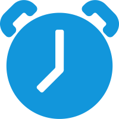

## 计划大纲

这是我最近整理的一些计划，由于有些东西不是很了解，下面吧这些东西列入以后的充电计划中，按照下面的计划不断完善自己，温故而知新

- [设计模式](#)
- [MongoDB](markdown/mongodb/mongodb-index.md)
- [Swoole](#)
- [KafKa](#) 以及 [Rabbitmq](#) 
- [Mysql](#)调优技巧.
- 算法数据结构
- Nginx负载均衡和Nginx反向代理
- [Hadoop快速入门](https://hadoop.apache.org/docs/r1.0.4/cn/quickstart.html)

## 列入计划

提升PHP方面的相关东西
学习设计模式
学习Go语言基础
学习Gin框架
学习BeeGo框架

## 次要计划

次要计划，不是很紧急的计划，当下可以缓一缓的计划，闲时可以来完成这里的计划

- **[金融理财](http://blog.54zm.com/)，学习一些关于理财的知识**
- **[基金理财](http://blog.54zm.com/)**

